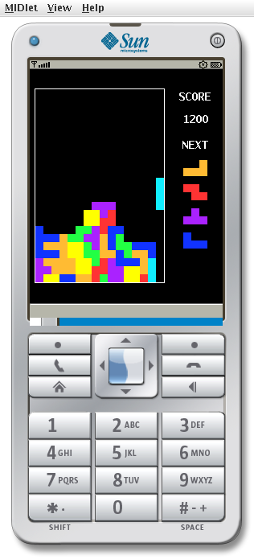

# J2ME Tetris

A custom version of Tetris written in J2ME Java for [Retrospect (J2ME)](https://retrospect.hackclub.com/j2me).

## Project status

- Currently lacking:

  - [ ] correct tetromino rotation
  - [ ] wall kicks
  - [ ] sound
  - [ ] persistent storage
  - [ ] hold tetromino
  - [ ] pause menu

## Building

Use Netbeans 8.2 and follow these intructions: https://microgram.app/blog/004-J2ME-development-in-2024-with-linux.html
